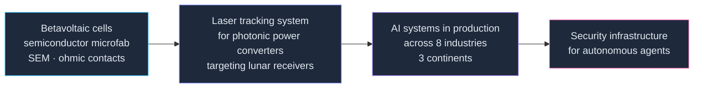

  
  
  

---

### Why this profile looks emptier than my hard drive

I've built more things than I've remembered to publish.

Some of it is under NDA and stays there. Most of it was just me, deep in a build, forgetting that `git push` is a thing that exists. I'm fixing the second category. The first one is doing fine where it is.

So: what's here is a fraction. What's below is the honest map.

---

### What I'm building right now

| Project | What it is | Status |
|---|---|---|
| **[Myles](https://github.com/ElamOlame31/Myles)** | The circuit breaker for AI agents. A zero-config local proxy that stops runaway loops and budget blowouts before they burn your API bill — any agent, any provider, no code changes. | Public · `Python` |
| **AgentGate** | Policy decision point for agentic AI. The layer that decides what an autonomous agent is actually allowed to do, before it does it. | Private beta |
| **Poisoning defence for hierarchical FL over NTN** | Master's research: making federated learning survive malicious clients across a BS → UAV → HAPS satellite topology. | Thesis, 2026 |

> The theme, if you want one: **agents are getting real authority, and almost nothing sits between them and your infrastructure.** I'd like to change that.

---

### The shelf I can't open

A real chunk of my work sits behind NDAs — client systems, internal platforms, things with other people's names on them. Here's the shape of it without the names:

| Domain | What I did | Stack |
|---|---|---|
| Attack surface management | Asset discovery + AI triage engine for exposure assessment | `Next.js` `FastAPI` `Postgres` |
| Threat-hunting SaaS | Full product, concept to deploy, two-week build | `Next.js` `Prisma` `Inngest` `Stripe` |
| AI automation for SMBs | Conversational AI, web and mobile delivery, as CTO | `Python` `TypeScript` `LLM APIs` |
| Applied AI consulting | Systems across mining, energy, tourism, finance, infrastructure — clients in North America, Europe, and Africa | varied |

Happy to talk through any of it in a conversation. Just can't put it in a repo.

---

### The range

I did not arrive here from a bootcamp. I got here sideways, through a physics lab.

Three years at [SUNLAB](https://www.sunlab.ca/) under Dr. Karin Hinzer taught me the thing that transfers everywhere: **if you can't measure it, you don't understand it yet.** Turns out that applies to AI agents about as well as it applies to solar cells.

---

### Toolbox

**Building** — Python · TypeScript · Next.js · FastAPI · Postgres · Prisma
**Agents & AI** — LangChain / LangGraph · MCP · multi-agent systems · RAG · evals
**Security** — agent authorization · attack surface management · policy engines
**Roots** — MATLAB · SEM characterisation · embedded systems · FPGA · signal processing

No badge wall. If it's on this list I've shipped something with it.

---

### Currently

- Finishing an **MEng in Electrical & Computer Engineering, Applied AI** at the University of Ottawa (Aug 2026)
- Building **AgentGate** — and looking for the first people brave enough to put it in front of a real agent
- Open to conversations about agent security, AI infrastructure, or anything nobody has figured out yet

**Reach me:** [portfolio](https://elamolamemugabo.com/) · [LinkedIn](https://www.linkedin.com/in/elam-olame-mugabo/)

---

A nerd who likes building things in his free (full) time. Still building, still learning, still figuring out what's next :)
