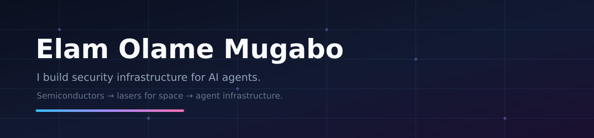
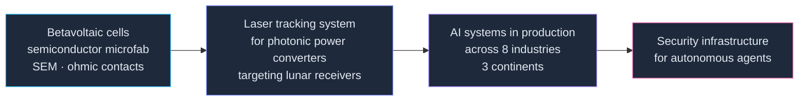

  
  
  

---

### What's next

Just finished an **MEng in Electrical & Computer Engineering, Applied AI** at the University of Ottawa.

> Building things. Learning. Growing. Figuring out what's next.

That last part isn't filler. I've spent a few years shipping other people's ideas and a handful of my own. Right now I'm working out what deserves the next several years — which problem, which idea, which company.

Taking my time with that one. Open to being convinced.

Meanwhile I'm **CTO at NOA** — the all-in-one money app for the globally connected, sitting across fintech and education. *Beyond borders, beyond limits.* I own technical strategy and execution there: architecture decisions, platform development, cross-functional delivery.

---

### Why this profile looks emptier than my hard drive

I've built more things than I've remembered to publish.

Some of it is under NDA and stays there. Most of it was just me, deep in a build, forgetting that `git push` is a thing that exists. I'm fixing the second category. The first one is doing fine where it is.

So: what's here is a fraction. What's below is the honest map.

---

### Where my energy went lately

| Project | What it is | Status |
|---|---|---|
| **[Myles](https://github.com/ElamOlame31/Myles)** | The circuit breaker for AI agents. A zero-config local proxy that stops runaway loops and budget blowouts before they burn your API bill — any agent, any provider, no code changes. | Public · `Python` |
| **AgentGate** | Policy decision point for agentic AI. The layer that decides what an autonomous agent is actually allowed to do, before it does it. | Private beta |
| **Poisoning defence for hierarchical FL over NTN** | Making federated learning survive malicious clients across a BS → UAV → HAPS satellite topology. Master's research under Prof. Burak Kantarci at [NEXTCON Lab](https://nextconlab.ca/). | Thesis, 2026 |
| **Adaptive adversarial defence for ML-based IDS** | Intrusion detection models look excellent on clean traffic and collapse under adversarial input. Built a two-tier defence that watches its own confidence and stability, then escalates from lightweight adversarial retraining to GAN-assisted reinforcement as the threat worsens — generating synthetic samples aimed at the fragile regions of the decision boundary rather than augmenting blindly. On CIC-IDS2017 (2.8M flows, FGSM / PGD / GAN attacks): **attack success rate down 60%**, false positives under attack **35.2% → 11.3%**. | Team research · `XGBoost` `WGAN-GP` |

> The theme, if you want one: **AI systems are being handed real authority, and almost nothing sits between them and the damage they can do.** A runaway agent, a poisoned model, an adversarial input — same gap, different door. I'd like to close a few of them.

---

### When the network is the adversary

Two halves of the same problem: making secure communication tools work in environments built to stop them.

| Project | What it is | Status |
|---|---|---|
| **Phoenix Key** | Portable, revocable identity for self-hosted communication tools. Lose your device to a seizure and today your identity — and your entire trusted network — goes with it. Phoenix Key lets you say *"this is my new key now"* and bring all of it back. Established cryptography, a signed log, no blockchain. | In progress |
| **NetScope** | Field measurement for restricted network environments. Teams deploying communication tools into allow-list intranets are guessing what the network actually lets through. NetScope replaces that guess with evidence — gathered safely, from inside the network itself. | In progress |

---

### The shelf I can't open

A real chunk of my work sits behind NDAs — client systems, internal platforms, things with other people's names on them. Here's the shape of it without the names:

| Domain | What I did | Stack |
|---|---|---|
| **Cybersecurity** · attack surface management | Built the discovery-to-triage pipeline: map an organisation's entire external footprint, then let an AI engine rank what an attacker would actually reach first | `Next.js` `FastAPI` `Postgres` |
| **Cybersecurity** · threat intelligence SaaS | Took a threat-hunting platform from empty repo to deployed product in two weeks — auth, billing, background jobs, the whole spine | `Next.js` `Prisma` `Inngest` `Stripe` |
| **AI automation** · SMB systems | As CTO: owned architecture and delivery across every client system in flight — conversational AI, web platforms, mobile apps | `Python` `TypeScript` `LLM APIs` |
| **Applied AI** · cross-industry | Shipped systems into mining, energy, tourism, finance and infrastructure for clients on three continents — usually starting from zero domain knowledge | varied |

Happy to talk through any of it in a conversation. Just can't put it in a repo.

---

### The back catalogue

Things that exist, work, and are still sitting on a drive somewhere. Category two from above.

| Project | What it does | Stack |
|---|---|---|
| **InOutVision** | Real-time intrusion and attendance detection. Recognises employees on camera, logs attendance automatically, and flags anyone who doesn't belong. | `YOLOv11` `FaceNet` `Computer vision` |
| **RANSAC plane detection** | Finds planar structures in 3D LiDAR point clouds so an autonomous vehicle can tell road from obstacle — built to improve navigation accuracy. | `LiDAR` `Point clouds` `Autonomous vehicles` |
| **Vehicle tracking & path estimation** | Tracks vehicles through a scene and estimates where they are heading. | `Computer vision` `State estimation` |

Getting pushed as I dig them out.

---

### The range

I did not arrive here from a bootcamp. I got here sideways, through a physics lab.

Three years at [SUNLAB](https://www.sunlab.ca/) under Prof. Karin Hinzer taught me the thing that transfers everywhere: **if you can't measure it, you don't understand it yet.** Turns out that applies to AI agents about as well as it applies to solar cells.

---

### Toolbox

**Building** — Python · TypeScript · Next.js · FastAPI · Postgres · Prisma
**Agents & AI** — LangChain / LangGraph · MCP · multi-agent systems · RAG · evals
**Cybersecurity** — attack surface management · threat intelligence · adversarial ML (FGSM · PGD · WGAN-GP) · agent authorization · policy engines
**Crypto & networks** — applied cryptography · identity and key management · signed logs · network measurement
**Vision** — YOLO · FaceNet · LiDAR point clouds · RANSAC · real-time inference
**Roots** — MATLAB · SEM characterisation · embedded systems · FPGA · signal processing

No badge wall. If it's on this list I've shipped something with it.

---

**Reach me:** [portfolio](https://elamolamemugabo.com/) · [LinkedIn](https://www.linkedin.com/in/elam-olame-mugabo/)

A nerd who likes building things in his free (full) time :)
