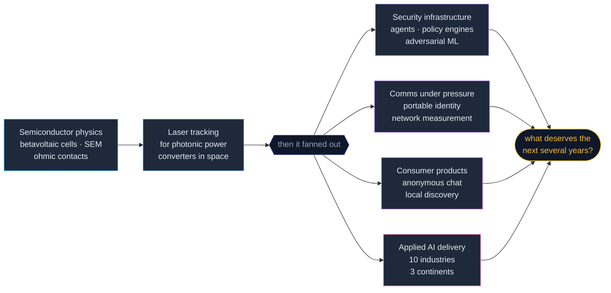

  
  
  

---

### What's next

Just finished an **MEng in Electrical & Computer Engineering, Applied AI** at the University of Ottawa.

> Building things. Learning. Growing. Figuring out what's next.

That last part isn't filler. I've spent a few years shipping other people's ideas and a handful of my own. Right now I'm working out what deserves the next several years — which problem, which idea, which company.

Taking my time with that one. Open to being convinced.

---

### Why this profile looks emptier than my hard drive

I've built more things than I've remembered to publish.

Some of it is under NDA and stays there. Most of it was just me, deep in a build, forgetting that `git push` is a thing that exists. I'm fixing the second category. The first one is doing fine where it is.

So: what's here is a fraction. What's below is the honest map.

---

### Where my energy went lately

| Project | What it is | Status |
|---|---|---|
| **Myles** — *started life as Ghost* | The circuit breaker for AI agents. A zero-config local proxy that sits between your tooling and whichever provider you use, and keeps the bill honest two ways: it routes mechanical work to a cheap model and real intent to the strong one — then checks the cheap answer actually held up before taking credit for the savings — and it cuts the loop when an agent starts burning money going in circles. Any agent, any provider, no code changes. | `Python` |
| **AgentGate** | Policy decision point for agentic AI. The layer that decides what an autonomous agent is actually allowed to do, before it does it. | Private beta |
| **Poisoning defence for hierarchical FL over NTN** | Making federated learning survive malicious clients across a BS → UAV → HAPS satellite topology. Master's research under Prof. Burak Kantarci at [NEXTCON Lab](https://nextconlab.ca/). | Thesis, 2026 |
| **NOA** — *CTO* | The all-in-one money app for the globally connected, sitting across fintech and education. *Beyond borders, beyond limits.* I hold the technical direction — architecture decisions, platform development, cross-functional delivery — and step in when the team needs me. | Ongoing, part-time |

> The theme running through most of it: **AI systems are being handed real authority, and almost nothing sits between them and the damage they can do.** A runaway agent, a poisoned model, an adversarial input — same gap, different door. I'd like to close a few of them.

---

### When the network is the adversary

Two halves of the same problem: making secure communication tools work in environments built to stop them.

| Project | What it is | Status |
|---|---|---|
| **Phoenix Key** | Portable, revocable identity for self-hosted communication tools. Lose your device to a seizure and today your identity — and your entire trusted network — goes with it. Phoenix Key lets you say *"this is my new key now"* and bring all of it back. Established cryptography, a signed log, no blockchain. | Built |
| **NetScope** | Field measurement for restricted network environments. Teams deploying communication tools into allow-list intranets are guessing what the network actually lets through. NetScope replaces that guess with evidence — gathered safely, from inside the network itself. | Built |

---

### The shelf I can't open

A real chunk of my work sits behind NDAs — client systems, internal platforms, things with other people's names on them. Here's the shape of it without the names:

| Domain | What I did | Stack |
|---|---|---|
| **Cybersecurity** · attack surface management | Built the discovery-to-triage pipeline: map an organisation's entire external footprint, then let an AI engine rank what an attacker would actually reach first | `Next.js` `FastAPI` `Postgres` |
| **Cybersecurity** · threat intelligence SaaS | Took a threat-hunting platform from empty repo to deployed product in two weeks — auth, billing, background jobs, the whole spine | `Next.js` `Prisma` `Inngest` `Stripe` |
| **AI automation** · SMB systems | As CTO: owned architecture and delivery across every client system in flight — conversational AI, web platforms, mobile apps | `Python` `TypeScript` `LLM APIs` |
| **Applied AI** · cross-industry | Shipped systems into mining, energy, tourism, finance and infrastructure for clients on three continents — usually starting from zero domain knowledge | varied |

Happy to talk through any of it in a conversation. Just can't put it in a repo.

---

### The back catalogue

Older work. Some of it still running, most of it sitting on a drive somewhere. Category two from above.

| Project | What it does | Stack |
|---|---|---|
| **[anyone.today](https://anyone.today/)** | *"When you can't talk to anyone, talk to anyone.today."* Anonymous one-to-one chat on a three-minute timer. Whoever is online gets paired at random, both sides get a throwaway handle that changes every single conversation, and the thread is destroyed when the timer runs out. Nothing is retained unless someone files a report — that is the only path to a human reviewer. Or you skip the stranger and talk to Echo, the AI, instead. Of the first 179 conversations, 131 were with a stranger and 48 with Echo. Built a while ago, still running. | `Real-time chat` `LLM APIs` |
| **Novouza** | Short-form video for local discovery. A feed of ~90-second clips of restaurants, activities and experiences, so you find something worth doing near you instead of reading twelve reviews. Idea to MVP: market research, scope, UX, build — Ottawa–Gatineau as the first market, around 100 venues. | `Next.js` `React` `LLM APIs` |
| **InOutVision** | Real-time intrusion and attendance detection. Recognises employees on camera, logs attendance automatically, and flags anyone who doesn't belong. | `YOLOv11` `FaceNet` `Computer vision` |
| **RANSAC plane detection** | Finds planar structures in 3D LiDAR point clouds so an autonomous vehicle can tell road from obstacle — built to improve navigation accuracy. | `LiDAR` `Point clouds` `Autonomous vehicles` |
| **Vehicle tracking & path estimation** | Tracks vehicles through a scene and estimates where they are heading. | `Computer vision` `State estimation` |
| **Adaptive adversarial defence for ML-based IDS** | Intrusion detection models look excellent on clean traffic and collapse under adversarial input. A two-tier defence that watches its own confidence and stability, then escalates from lightweight adversarial retraining to GAN-assisted reinforcement as the threat worsens — generating synthetic samples aimed at the fragile regions of the decision boundary rather than augmenting blindly. On CIC-IDS2017 (2.8M flows): **attack success rate down 60%**, false positives under attack **35.2% → 11.3%**. Team research. | `XGBoost` `WGAN-GP` `FGSM / PGD` |

Somewhere across all of this I've shipped something into space exploration, mining, cybersecurity, tourism, transportation, energy, urban development, finance, infrastructure, and airport technology. Written out like that, it reads less like a career and more like a dare.

And it still isn't the full list. Every few weeks I remember another one and quietly add it here — which makes this page less a portfolio than an ongoing archaeological dig through my own hard drive. Things get pushed as I unearth them.

---

### The range

I did not arrive here from a bootcamp. I got here sideways, through a physics lab — and then kept going sideways.

Three years at [SUNLAB](https://www.sunlab.ca/) under Prof. Karin Hinzer taught me the thing that transfers everywhere: **if you can't measure it, you don't understand it yet.** Turns out that applies to AI agents about as well as it applies to solar cells.

On paper the list looks scattered. In practice it has been the same job every time: walk into a domain I don't know yet, work out what actually matters in it, and build the thing that was missing.

---

### The paperwork

| | |
|---|---|
| **MEng, Electrical & Computer Engineering** — concentration in Applied AI | University of Ottawa · 2025–2026 |
| **BASc, Electrical Engineering** — Systems Engineering specialisation | University of Ottawa · 2021–2025 |
| **BSc, Computing Technology** | University of Ottawa · 2021–2025 |
| **CESS, Mathematics & Sciences** | Lycée Prince de Liège, Kinshasa · 2018–2021 |

Yes, two bachelors with the same end date. That combination is built to take five years. I did it in four and graduated **valedictorian** — which mostly meant writing a speech on top of everything else. A few scholarships came along the way, some for research, some for grades, and one that paid for the master's.

In fairness, those four years weren't only coursework. They also held three years of semiconductor research at SUNLAB, a company I was quietly running on the side, and a rotation of clients who regarded my exam schedule as an interesting but non-binding suggestion. Sleep was in there somewhere too, allegedly.

For the sake of your mental health, I would not recommend this. To anyone. Ever.

That said — if I had to run it back, I'd probably try for three.

That last one is a Belgian curriculum, taught in Kinshasa (DR Congo) — which makes "where did you go to school" a longer answer than most people are expecting. I'm fluent in French, English and Lingala, and still fighting to hold on to Swahili and Dutch, both of which are quietly packing their bags.

---

### Toolbox

**Building** — Python · TypeScript · React / Next.js · FastAPI · Postgres · Prisma
**Agents & AI** — LangChain / LangGraph · MCP · multi-agent systems · RAG · evals · model routing
**Cybersecurity** — attack surface management · threat intelligence · adversarial ML (FGSM · PGD · WGAN-GP) · agent authorization · policy engines
**Crypto & networks** — applied cryptography · identity and key management · signed logs · network measurement
**Vision** — YOLO · FaceNet · LiDAR point clouds · RANSAC · real-time inference
**Roots** — MATLAB · SEM characterisation · embedded systems · FPGA · signal processing

No badge wall. If it's on this list I've shipped something with it.

---

### Off the clock

Two things, mostly.

The first is that I genuinely just like making things exist. An idea shows up, and I want to see it running. That's the whole hobby — everything else is implementation detail.

The second is reading. A lot of reading.

<b>📚 What's on the pile right now</b> — click to open

 

**Currently reading**

- *The Bible* — every day, or at least that's the arrangement I have with myself
- *Understanding Your Potential* — Myles Munroe

**Finished in 2026**

- *Wisdom Takes Work* — Ryan Holiday
- *Sortir du Vide* — Dr Mireille Basirwa
- *The Business of Philanthropy* — Badr Jafar
- *Machiavélisme financier* — West Ornan Monga
- *Les mystères de l'éloquence* — Grégory Levy & Gilles-Jean Portejoie
- *Discipline Is Destiny* — Ryan Holiday
- *Unleash Your Purpose* — Myles Munroe
- *The Delulu We Live In* — Israel Goytom

**Bought, queued, or being hunted down**

- *The Joseph-Daniel Calling* — Morris E. Ruddick
- *Emotional Intelligence: Why It Can Matter More Than IQ* — Daniel Goleman
- *Manifesto for a Moral Revolution* — Jacqueline Novogratz
- *The Wealth of Nations* — Adam Smith
- *The Psychology of Money* — Morgan Housel
- *Releasing Your Potential* — Myles Munroe
- *Maximizing Your Potential* — Myles Munroe
- *How to Win Friends and Influence People* — Dale Carnegie

 

Recommendations welcome. My backlog is already unreasonable, so one more won't hurt.

---

**Reach me:** [portfolio](https://elamolamemugabo.com/) · [LinkedIn](https://www.linkedin.com/in/elam-olame-mugabo/)

A nerd who likes building things in his free (full) time :)
